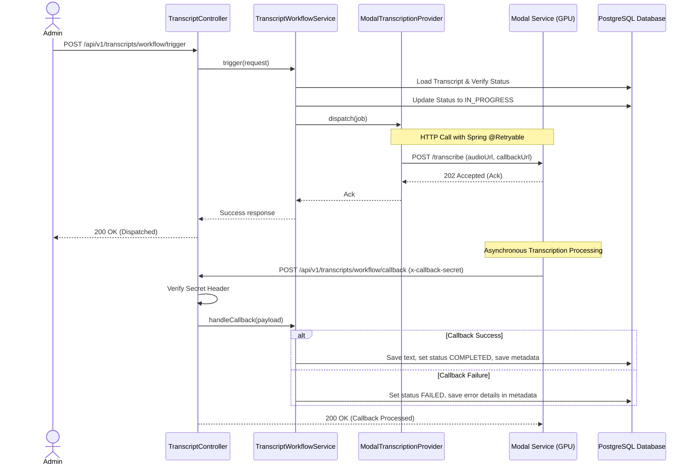
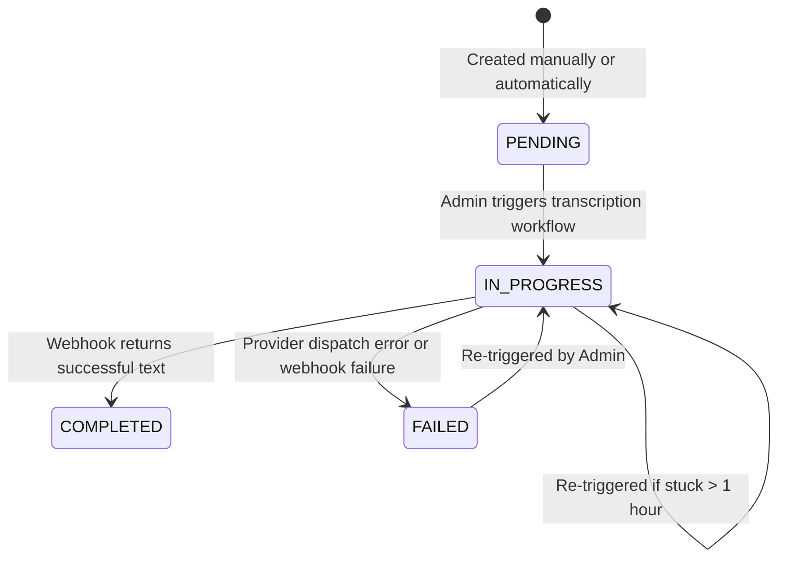

# Transcription System Architecture

This document describes the design, workflow, and resilience mechanisms of the asynchronous audio transcription pipeline in Koinonia Daily Server.

---

## 1. Overview
The transcription pipeline translates raw audio files of spiritual teachings into structured text transcripts. To handle the high-latency and GPU resource requirements of deep learning models, transcription is executed asynchronously via external serverless GPU workloads (e.g., Modal running `faster-whisper`).

The Spring Boot backend orchestrates this process using a decoupled **Provider-Webhook Callback pattern** with built-in retry resilience and status tracking.

---

## 2. System Architecture & Workflow

The transcription workflow follows a fully asynchronous lifecycle:



### Step-by-Step Execution:
1. **Triggering:** An administrator initiates transcription via `POST /api/v1/transcripts/workflow/trigger`.
2. **State Guardrail Check:** The system verifies the transcript status. If a transcription is already `IN_PROGRESS`, the request is rejected—unless the job has been stuck for more than one hour, in which case a retry/overwrite is allowed.
3. **Dispatching:** The [TranscriptWorkflowService](file:///home/gbenga/Vision/Java/Koinonia-Daily/server/src/main/java/org/eni/koinoniadaily/modules/transcript/TranscriptWorkflowService.java) constructs a payload specifying the audio URL and the webhook callback URL (`/api/v1/transcripts/workflow/callback`), then dispatches it via a `TranscriptionProvider`.
4. **Serverless Execution:** The [ModalTranscriptionProvider](file:///home/gbenga/Vision/Java/Koinonia-Daily/server/src/main/java/org/eni/koinoniadaily/infrastructure/transcription/providers/ModalTranscriptionProvider.java) calls the remote serverless GPU endpoint (secured via an API key).
5. **Webhook Callback:** Once the transcription finishes, the remote service sends a webhook callback containing the result text or error details back to the server. The request must present a valid `x-callback-secret` header.
6. **State Resolution:** The callback handler persists the transcribed text and updates the status to `COMPLETED` or `FAILED` along with execution metadata (e.g. model duration, errors).

---

## 3. Database Schema & State Machine

The transcripts table holds the status and metadata for each transcription job.

### Database Migration (`V8__add_status_and_metadata_to_transcripts_table.sql`)
```sql
ALTER TABLE transcripts
  ADD COLUMN status VARCHAR(20) NOT NULL DEFAULT 'PENDING',
  ADD CONSTRAINT transcripts_status_check
    CHECK (status IN ('PENDING', 'IN_PROGRESS', 'COMPLETED', 'FAILED')),
  ADD COLUMN metadata JSONB;
```

### State Transitions
The lifecycle of a transcript transitions through the following states:



- **`PENDING`**: Initial state where no transcription has been run yet.
- **`IN_PROGRESS`**: The transcription job has been successfully dispatched to the provider.
- **`COMPLETED`**: The transcript text is successfully retrieved, mapped to the database, and ready for chunking/indexing.
- **`FAILED`**: The dispatch failed, or the remote execution encountered an error.

---

## 4. Resilience & Error Handling

To ensure maximum reliability when dealing with remote third-party services, the transcription pipeline uses multiple layers of error handling:

### 1. Exponential Backoff Retries
The [ModalTranscriptionProvider](file:///home/gbenga/Vision/Java/Koinonia-Daily/server/src/main/java/org/eni/koinoniadaily/infrastructure/transcription/providers/ModalTranscriptionProvider.java) is annotated with Spring `@Retryable` to handle transient network issues or remote 5xx server issues:
- **Max Retries:** 2 (total 3 attempts).
- **Initial Delay:** 1000 ms.
- **Multiplier:** 2.0 (exponentially increases wait time).
- **Max Delay:** 5000 ms.
- **Jitter:** 500 ms (distributes request concurrency spikes).
- **Retried Exceptions:** `HttpServerErrorException` (5xx errors), `ResourceAccessException` (network timeout).
- **Excluded Exceptions:** `ValidationException` (authentication issues, 4xx bad requests).

### 2. Stuck Job Recovery
If a remote runner fails silently without hitting the webhook callback, the transcript could remain locked in `IN_PROGRESS` indefinitely.
To recover:
- The [TranscriptWorkflowService](file:///home/gbenga/Vision/Java/Koinonia-Daily/server/src/main/java/org/eni/koinoniadaily/modules/transcript/TranscriptWorkflowService.java) permits re-triggering a job that is `IN_PROGRESS` if its last updated time is older than **1 hour**.
- This acts as an automated lock release for manual retries without database intervention.

### 3. Webhook Authentication
To prevent spoofing or unauthorized modification of transcripts, the callback endpoint requires header authentication:
- **Header:** `x-callback-secret`
- **Verification:** Compared against the configured property `app.transcription.modal.callback-secret`.
- **Handling:** Mismatches result in an immediate `401 Unauthorized` response, preventing any edits to the database.
